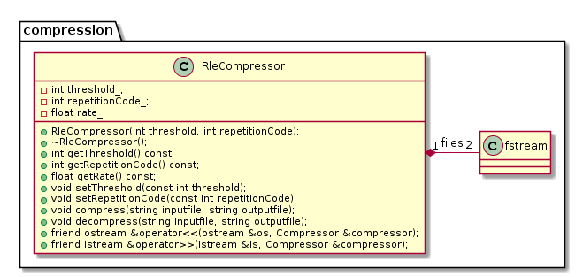

# TP C++ n<sup>o</sup> 9

## Compression RLE
### Objectif
Réaliser une classe `Compresseur` répondant aux algorithmes de compression/décompression de données mettant en oeuvre la méthode RLE.

## Pré-requis
- TP n<sup>o</sup> 7
- la [compression RLE](tp09/rle.md)

### Travail demandé

On désire créer une classe `Compresseur` déclarée dans le fichier `compress.h` et définie dans le fichier `compress.cxx`.
Le diagramme de classes UML est le suivant (`fstream` est une classe déclarée dans `<fstream>` et permet de gérer les fichiers de données) :



Les fonctions membres compresser et decompresser doivent répondre aux prototypes suivants :

````
void compresser(string fichierEntree, string fichierSortie);
void decompresser(string fichierEntree, string fichierSortie);
````
			
#### 1. Algorithmes
Donner en pseudolangage les algorithmes des fonctions `compresser` et `decompresser`. Justifier le choix du type de vos variables.

#### 2. Implémentation de la classe
Implémenter en C++ la classe `Compresseur`.

#### 3. Test de la classe
Valider la classe en compressant le fichier test [`image.xpm`](tp09/image.xpm). Le fichier destination sera nommé `image.xp_`. Éditer le fichier compressé et vérifier son intégrité. Décompresser `image.xp_` en `image2.xpm` et relever le taux de compression obtenu.

#### 4. Amélioration de la classe
Nous avons précédemment mesuré le taux de compression par une méthode contestable. Modifier la classe en conséquence pour permettre un calcul automatique du taux.


### Conditions
*   Compilateur GNU C++
*   Système d'exploitation GNU/Linux, Mac OS X ou Ms-Windows

### Critères d'évaluation
*   Qualité et organisation des documents rendus (codes sources, fichier LISEZMOI, etc.)
*   Autonomie
