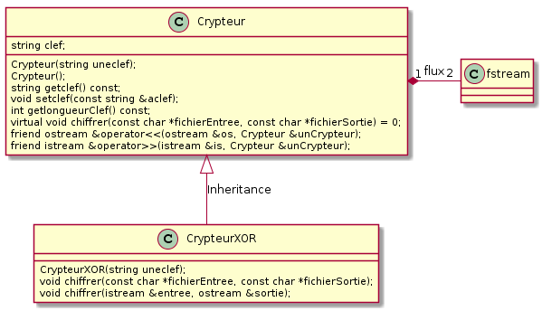

# TP C++ n<sup>o</sup> 10

## Chiffrement XOR
### Objectif
Réaliser une classe `Crypteur` répondant à l'algorithme de chiffrement/déchiffrement mettant en oeuvre la méthode du OU Exclusif (en anglais XOR).

## Pré-requis
- TP n<sup>o</sup> 7
- le [chiffrement XOR](tp10/xor.md)

### Travail demandé

On désire créer une classe `Crypteur` déclarée dans le fichier `crypteur.h` et implémentée dans le fichier `crypteur.cxx`. Le diagramme de classes UML est le suivant (`fstream` est une classe déclarée dans `<fstream>` et permet de gérer les fichiers de données) :



La fonction membre `crypter()` doit répondre au prototype suivant :

```void crypter (const string fichierEntree, const string fichierSortie);```

#### 1. Algorithmes
Donner en pseudolangage l'algorithme de la fonction membre `crypter()`. Justifier le type des variables choisies.

#### 2. Implémentation de la classe 
Implémenter en C++ la classe `Crypteur`.

#### 3. Test de la classe
Valider la classe en chiffrant le fichier [texte.txt](tp10/texte.txt). Le fichier destination sera nommé `texte.$$$`. Éditer le fichier chiffré à l'aide d'un éditeur hexadécimal et vérifier son intégrité par rapport à l'algorithme XOR. Vérifier la fonction inverse en déchiffrant `texte.$$$` en `texte.ok`.


### Conditions
*   Compilateur GNU C++
*   Système d'exploitation GNU/Linux, Mac OS X ou Ms-Windows

### Critères d'évaluation
*   Qualité et organisation des documents rendus (codes sources, fichier LISEZMOI, etc.)
*   Autonomie
